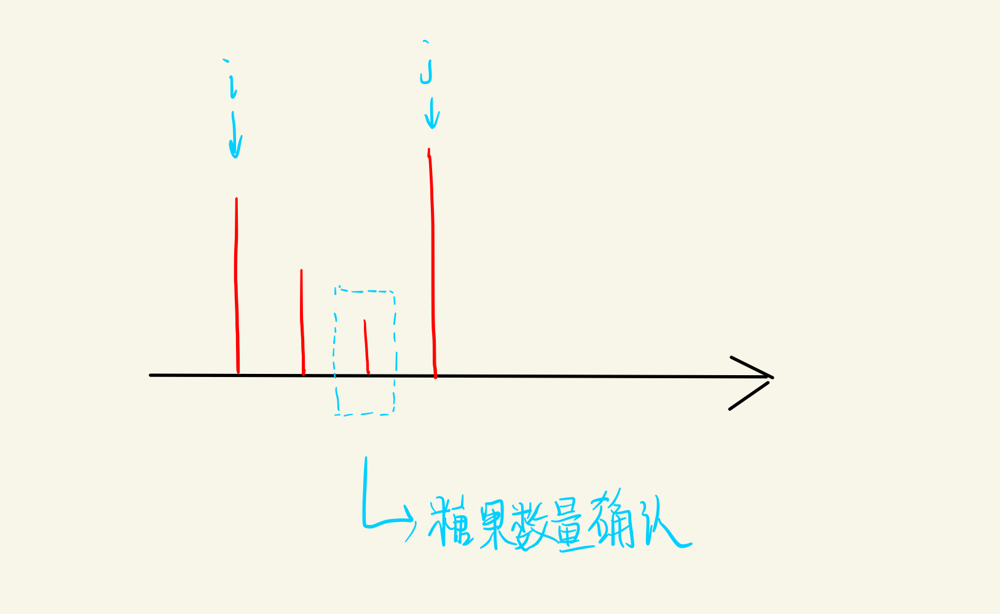

#   Candy
```
n 个孩子站成一排。给你一个整数数组 ratings 表示每个孩子的评分。

你需要按照以下要求，给这些孩子分发糖果：

每个孩子至少分配到 1 个糖果。
相邻两个孩子评分更高的孩子会获得更多的糖果。
请你给每个孩子分发糖果，计算并返回需要准备的 最少糖果数目 。

 
来源：力扣（LeetCode）
链接：https://leetcode.cn/problems/candy
著作权归领扣网络所有。商业转载请联系官方授权，非商业转载请注明出处。
```
**示例**
```
输入：ratings = [1,0,2]
输出：5
解释：你可以分别给第一个、第二个、第三个孩子分发 2、1、2 颗糖果。

输入：ratings = [1,2,2]
输出：4
解释：你可以分别给第一个、第二个、第三个孩子分发 1、2、1 颗糖果。
```
**思路1**
1. 首先观察题目找规律：从头开始数，当找到一个孩子的分数高于前面一个孩子的分数时，其实该孩子前面每个孩子可以分得的糖果数量就可以确定了。
2. 那么我们采用双指针的方法，始终使用一个指针用来定位已经被确定了分发糖果数量的孩子，另一个指针用于遍历数组。
===

3. 由上图可知，当j指针到图中位置时，j-1处因该分发的糖果数量为1，当j-1被确认后那么j-2也会被确认，以此类推一直到i。
4. 将i跳到j，j++，i指针之前便是已经确定了分发糖果数量的位置。
```cpp
int candy(vector<int>& ratings) {
        int size = ratings.size();
        vector<int> nums(size,1);
        int i = 0,j = 1;
        for(j;j<size;j++)
        {
            if(ratings[j]>ratings[j-1])
            {
                nums[j] = nums[j-1]+1;
                int k = j-1;
                int start = nums[k];
                for( k;k>i;k--)
                {
                    nums[k] = start;
                    start++;
                    if(k<size-1&&ratings[k] == ratings[k+1])
                    {
                        nums[k] = 1;
                        start = 2;
                    }
                }
                if(nums[i]<start)
                {
                    nums[i] = start;
                if(ratings[i] == ratings[i+1])
                {
                    if(i==0)
                    {
                        nums[i] = 1;
                    }
                    else{
                        nums[i] = nums[i-1]+1;
                    }
                }
                }
                i = j;
            }
        }
        if(i<size-1)
        {
            int k = size-1;
            int start = nums[k];
            for(k;k>i;k--)
            {
                nums[k] = start;
                start++;
                if(k<size-1&&ratings[k] == ratings[k+1])
                {
                    nums[k] = 1;
                    start = 2;
                }
            }
            if(nums[i]<start)
            {
                nums[i] = start;
                if(ratings[i] == ratings[i+1])
                {
                    if(i==0)
                    {
                        nums[i] = 1;
                    }
                    else{
                        nums[i] = nums[i-1]+1;
                    }
                }
            }
        }
        int sum = 0;
        for(int t = 0;t<size;t++)
        {
            sum+=nums[t];
        }
        return sum;
    }
   ```
**思路2**
1. 相邻的孩子中，评分高的孩子必须获得更多的糖果 = 左规则+右规则。
2. 左规则：当ratings[i]>ratings[i-1]时，i号孩子的糖要比i-1号孩子多。
3. 右规则：当ratings[i]>ratings[i+1]时，i号孩子的糖要比i+1号孩子多。
4. 因此当一个孩子手里糖的数量最少且满足左右规则时就是我们要求的答案。
```cpp
int candy(vector<int>& ratings)
{
    int size = ratings.size();
    vector<int> left(size,1);
    vector<int> right(size,1);
    for(int i = 0;i < size; i++)
    {
        if(i>0&&ratings[i]>ratings[i-1])
        {
            left[i] = left[i-1]+1;
        }else left[i] = 1;
    }
    for(int i = size-1;i>=0;i--)
    {
        if(i<size-1&&ratings[i]>ratings[i+1])
        {
            right[i] = right[i+1]+1;
        }else right[i] = 1;
    }
    int sum = 0;
    for(int i = 0; i<size;i++)
    {
        sum+=max(left[i],right[i]);
    }
    return sum;
}
```
******
注意第二种方法核心思路是找出满足左规则的最优数组，和满足右规则的最优数组，需要想到满足这两个条件的数组为最优答案。